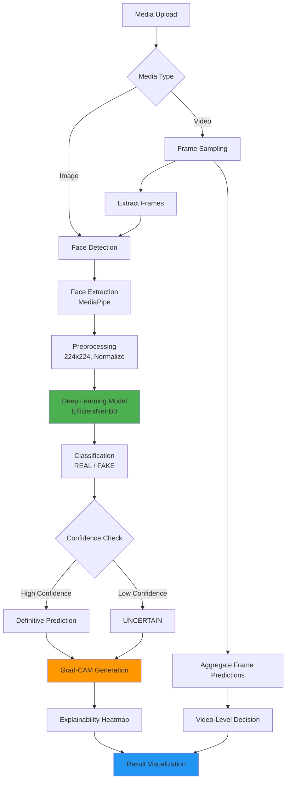

<div align="center">

# DeepTrust: Deepfake Detection with Explainable AI

[](https://www.python.org/)
[](https://pytorch.org/)
[](https://fastapi.tiangolo.com/)
[](https://reactjs.org/)
[](https://www.typescriptlang.org/)

**AI-powered deepfake detection system with explainable predictions**

[Features](#key-features) • [Architecture](#system-architecture) • [Installation](#installation-and-setup) • [API](#api-endpoints)

</div>

---

## Overview

DeepTrust provides automated detection of AI-generated and manipulated media through:

- **Automated Detection**: Fast analysis of images and videos
- **Explainable AI**: Visual heatmaps showing decision-relevant regions
- **Conservative Classification**: Three-tier system (REAL, FAKE, UNCERTAIN) to handle ambiguity
- **Ethical Design**: Prioritizes user protection and transparency

## Key Features

- **Multi-Modal Analysis**: Image and video deepfake detection
- **Face-Centric Processing**: Automatic face extraction using MediaPipe
- **Confidence-Based Predictions**: REAL, FAKE, or UNCERTAIN classification with probability scores
- **Grad-CAM Visualizations**: Highlights facial regions influencing decisions
- **Video-Level Inference**: Frame sampling with aggregation for temporal consistency
- **Production-Ready API**: FastAPI backend with RESTful endpoints
- **Modern Web Interface**: React-based frontend

## System Architecture



### Pipeline Components

1. **Face Detection**: MediaPipe Face Detection (model selection: 1, confidence: 0.5)
2. **Preprocessing**: Resize to 224×224, ImageNet normalization
3. **Model**: EfficientNet-B0 pretrained on ImageNet, fine-tuned on deepfake data
4. **Inference**: Softmax probabilities with confidence thresholding
5. **Explainability**: Grad-CAM targeting final convolutional layer
6. **Video Processing**: Uniform frame sampling (5-6 frames), majority voting

## Dataset

### Celeb-DF v2

DeepTrust is trained on the **Celeb-DF (Celeb Deep Fake) v2** dataset, a high-quality benchmark for deepfake detection research.

**Dataset Characteristics:**
- **Real Videos**: Celebrity interviews and public appearances
- **Fake Videos**: High-quality face-swap deepfakes
- **Split Strategy**: Video-level splitting to prevent data leakage
  - Training: 70%
  - Validation: 15%
  - Test: 15%

**Preprocessing:**
- 5 frames uniformly sampled per video
- Faces extracted and cropped using MediaPipe
- Resized to 224×224 for model input

## Model Architecture and Training

### Model Configuration

| Component | Details |
|-----------|--------|
| **Architecture** | EfficientNet-B0 |
| **Framework** | PyTorch |
| **Pretrained Weights** | ImageNet |
| **Fine-tuning** | Full model fine-tuning on deepfake data |

### Training Configuration

- **Loss Function**: Weighted Cross-Entropy Loss (class weighting to handle imbalance)
- **Optimizer**: Adam (learning rate: 1e-4)
- **Batch Size**: 32
- **Epochs**: 10
- **Data Augmentation**: Random horizontal flip
- **Normalization**: ImageNet statistics

### Training Strategy

**Face-Level Training**: Model trained on individual face crops extracted from video frames.

**Video-Level Inference**: Multiple frames sampled from each video, predictions aggregated using majority voting for final video-level classification. This improves robustness by leveraging temporal information.

## Evaluation Results

### Test Set Performance

- **Test Accuracy**: ~91-92%
- **Fake Detection Recall**: ~93%
- **Real Detection Precision**: ~90%

### Classification Strategy

Conservative uncertainty threshold:
- **FAKE**: Confidence > 65%
- **REAL**: Confidence > 65%
- **UNCERTAIN**: Confidence 45-65%

This prioritizes AI safety by flagging ambiguous cases rather than forcing overconfident predictions.

### Strengths & Limitations

**Strengths:**
- Strong performance on high-quality deepfakes
- Effective face extraction and preprocessing
- Robust to lighting and pose variations

**Limitations:**
- Performance degrades on low-resolution or compressed media
- Limited to single-face scenarios
- May struggle with adversarial perturbations
- Dataset-specific biases

## Explainability: Grad-CAM Visualization

### What is Grad-CAM?

Gradient-weighted Class Activation Mapping (Grad-CAM) highlights which image regions most influenced the model's decision.

**Process:**
1. Compute gradients of predicted class w.r.t. final convolutional layer
2. Weight feature maps by importance
3. Generate heatmap overlay showing decision-relevant regions

### Why Explainability Matters

In AI safety applications, trust requires transparency. Grad-CAM provides:

- **Verification**: Confirms model focuses on facial features, not background artifacts
- **Debugging**: Identifies spurious correlations
- **User Trust**: Enables non-expert understanding
- **Accountability**: Enables model behavior auditing

### Interpretation

**Fake Predictions**: Heatmaps typically highlight unnatural skin texture, boundary artifacts around eyes/mouth, and lighting inconsistencies.

**Real Predictions**: Consistent attention across natural facial features with no localized anomalies.

## Visual Results

<div align="center">

### Detection Examples with Grad-CAM Explanations

<table>
  <tr>
    <td align="center" width="50%">
      
      <br/>
      <b>FAKE Detection</b>
      <br/>
      <em>Grad-CAM highlights manipulation artifacts around facial features</em>
    </td>
    <td align="center" width="50%">
      
      <br/>
      <b>REAL Detection</b>
      <br/>
      <em>Natural facial features with consistent attention patterns</em>
    </td>
  </tr>
</table>

</div>

## Installation and Setup

### Prerequisites

- Python 3.8+
- Node.js 16+
- CUDA GPU (optional, for faster inference)

### Backend Setup

```bash
# Navigate to backend directory
cd DeepTrust/backend

# Create and activate virtual environment
python -m venv venv

# Windows:
.\venv\Scripts\activate
# Linux/Mac:
source venv/bin/activate

# Install dependencies
pip install -r requirements.txt
```

### Frontend Setup

```bash
# Navigate to project root
cd DeepTrust

# Install dependencies
npm install
```

### Model Weights

Place trained model file at: `backend/models/best_efficientnet_b0.pth`

## Running the Application

### Start Backend Server

```bash
cd backend
python app.py
```

Backend runs on: `http://localhost:8000`  
API Documentation: `http://localhost:8000/docs`

### Start Frontend Server

```bash
npm run dev
```

Frontend runs on: `http://localhost:5173`

### Using the Application

1. Navigate to frontend URL in browser
2. Upload image (JPG, PNG) or video (MP4)
3. Wait for processing (1-3s for images, 5-10s for videos)
4. Review results:
   - Verdict: REAL, FAKE, or UNCERTAIN
   - Confidence score: 0-100%
   - Explanation text
   - Grad-CAM heatmap (for images)
   - Frame analysis (for videos)
### API Endpoints

#### Image Analysis
```http
POST /api/analyze/image
Content-Type: multipart/form-data
Body: file (image file)

Response:
{
  "success": true,
  "verdict": "FAKE" | "REAL" | "UNCERTAIN",
  "confidence": 87.5,
  "explanation": "...",
  "probabilities": {
    "fake": 87.5,
    "real": 12.5
  },
  "heatmap_url": "/results/xxx_heatmap.jpg"
}
```

#### Video Analysis
```http
POST /api/analyze/video
Content-Type: multipart/form-data
Body: file (video file)

Response:
{
  "success": true,
  "verdict": "FAKE",
  "confidence": 85.3,
  "explanation": "...",
  "frames": [...],
  "total_frames": 6
}
```

## Technology Stack

<table>
<tr>
<td width="33%" valign="top">

### Backend
- **FastAPI**: Web framework
- **PyTorch**: Deep learning
- **timm**: EfficientNet implementation
- **OpenCV**: Video processing
- **MediaPipe**: Face detection
- **Grad-CAM**: Explainability

</td>
<td width="33%" valign="top">

### Frontend
- **React 18**: UI framework
- **TypeScript**: Type safety
- **Tailwind CSS**: Styling
- **Vite**: Build tool

</td>
<td width="33%" valign="top">

### Model
- **EfficientNet-B0**: CNN architecture
- **PyTorch 2.1**: Inference engine
- **CUDA**: GPU acceleration

</td>
</tr>
</table>

## Ethical Considerations

### Privacy and Safety

- No biometric storage: Faces processed in memory and discarded
- No identity tracking: System detects manipulation, not identity
- Local processing: All inference server-side, no third-party data sharing

### Dataset Usage

- Celeb-DF dataset for research and educational purposes only
- No commercial deployment without proper licensing
- Compliance with dataset terms and regulations

### Limitations and Risks

**Known Limitations:**
- False negatives on sophisticated deepfakes
- False positives on heavily edited authentic media
- Performance degrades on out-of-distribution data
- Vulnerable to adversarial attacks

**Misuse Risks:**
- Not foolproof; should not be sole basis for critical decisions
- Adversaries may develop detection-resistant deepfakes
- Overreliance may create false sense of security

**Recommended Usage:**
- Use as one component in multi-layered verification
- Combine with metadata analysis and human review
- Update models regularly as deepfake techniques evolve

## Future Improvements

### Technical Enhancements
- Multi-face detection and analysis
- LSTM/Transformer architectures for temporal video analysis
- Adversarial robustness training
- Model compression for edge deployment

### Feature Additions
- Batch processing for multiple files
- Audio deepfake detection
- Metadata forensics and EXIF analysis
- API rate limiting for production deployment

### Research Directions
- Cross-dataset generalization
- Zero-shot detection for novel manipulation techniques
- Bayesian uncertainty quantification
- Advanced interpretability beyond Grad-CAM

## Contributing

Contributions are welcome! Please follow these guidelines:

1. Fork the repository
2. Create a feature branch (`git checkout -b feature/YourFeature`)
3. Commit your changes (`git commit -m 'Add YourFeature'`)
4. Push to the branch (`git push origin feature/YourFeature`)
5. Open a Pull Request

## License

This project is for **educational and research purposes**. Ensure compliance with dataset licenses and applicable laws before commercial use.

## Citation

If you use DeepTrust in your research, please cite:

```bibtex
@software{deeptrust2026,
  title={DeepTrust: Deepfake Detection with Explainable AI},
  author={Your Name},
  year={2026},
  url={https://github.com/yourusername/DeepTrust}
}
```

## Acknowledgments

- **Celeb-DF Dataset**: Li et al., "Celeb-DF: A Large-scale Challenging Dataset for DeepFake Forensics"
- **EfficientNet**: Tan and Le, "EfficientNet: Rethinking Model Scaling for Convolutional Neural Networks"
- **Grad-CAM**: Selvaraju et al., "Grad-CAM: Visual Explanations from Deep Networks via Gradient-based Localization"
- **MediaPipe**: Google Research, MediaPipe Face Detection

## Contact

For questions, issues, or collaboration opportunities, please open an issue on GitHub or contact [johiyaharsh@gmail.com].

---

<div align="center">

**Disclaimer**: This tool is designed for research and educational purposes. Deepfake detection is an active area of research with ongoing challenges. Always verify critical information through multiple independent sources.

</div>


