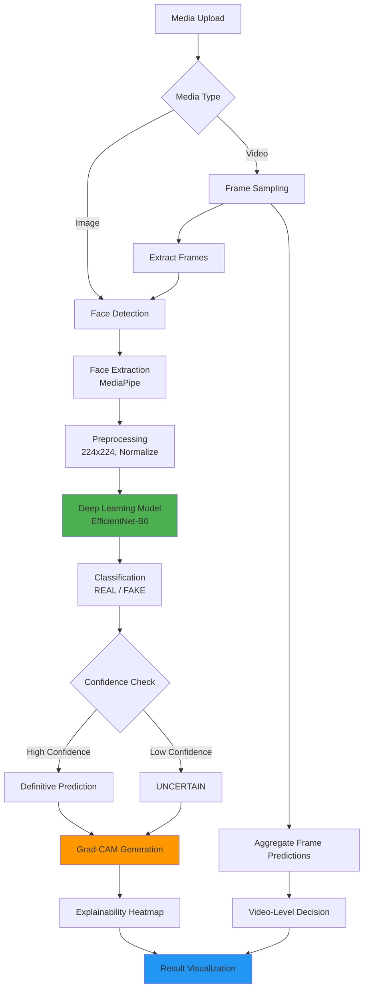
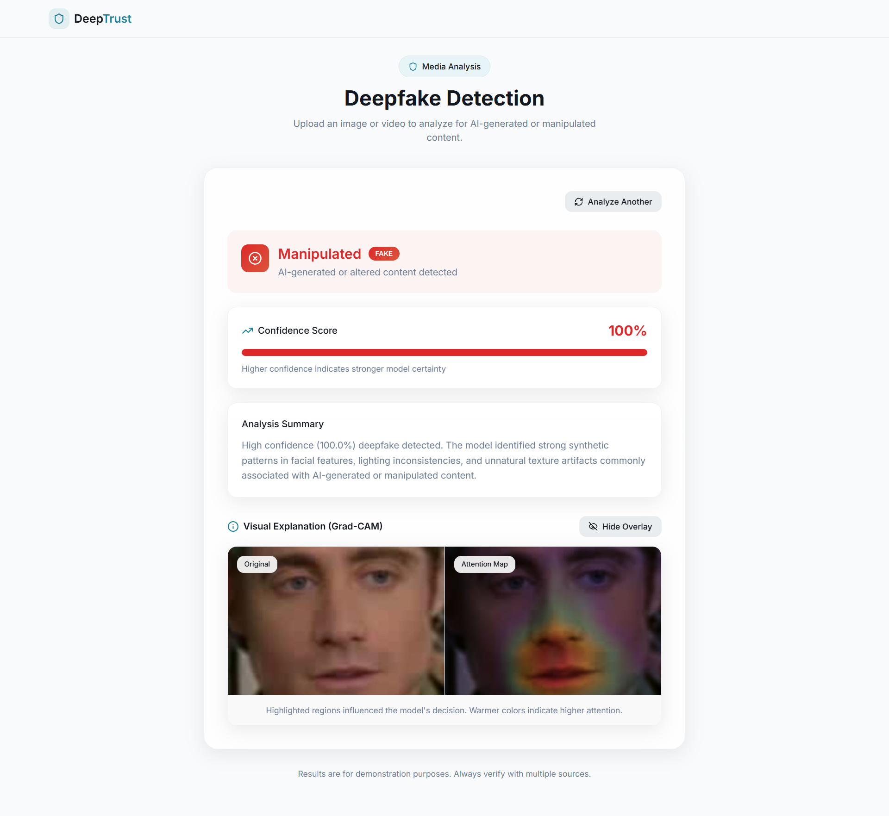
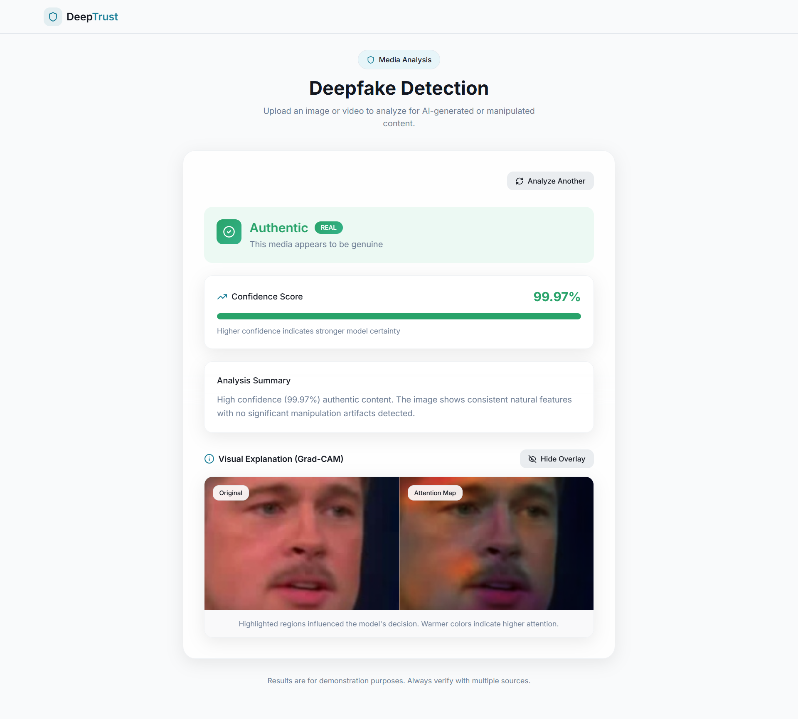

<div align="center">

# 🛡️ DeepTrust: Deepfake Detection with Explainable AI

[](https://www.python.org/)
[](https://pytorch.org/)
[](https://fastapi.tiangolo.com/)
[](https://reactjs.org/)
[](https://www.typescriptlang.org/)
[](LICENSE)

**An end-to-end AI-powered system for detecting deepfakes with explainable predictions**

[Features](#-key-features) • [Architecture](#-system-architecture) • [Installation](#-installation-and-setup) • [API Docs](#-api-endpoints) • [Results](#-visual-results)

</div>

---

## 🎯 Problem Statement

The proliferation of AI-generated and manipulated media poses significant threats to information integrity, personal security, and public trust. DeepTrust addresses this challenge by providing:

- 🤖 **Automated Detection**: Fast, scalable analysis of images and videos
- 🔍 **Transparency**: Explainable predictions through visual heatmaps
- ⚖️ **Conservative Classification**: Uncertainty handling to minimize false confidence
- 🛡️ **AI Safety**: Ethical design prioritizing user protection over classification accuracy

## ✨ Key Features

- 📸 **Multi-Modal Analysis**: Support for both image and video deepfake detection
- 👤 **Face-Centric Processing**: Automatic face extraction and cropping using MediaPipe
- 📊 **Confidence-Based Predictions**: Three-tier classification (REAL, FAKE, UNCERTAIN) with probability scores
- 🎨 **Explainable AI**: Grad-CAM visualizations highlighting decision-relevant facial regions
- 🎬 **Video-Level Inference**: Frame sampling and aggregation for temporal consistency
- ⚡ **Production-Ready API**: FastAPI backend with RESTful endpoints
- 💻 **Modern Web Interface**: React-based frontend for interactive analysis

## 🏗️ System Architecture



### 🔧 Pipeline Components

1. 👁️ **Face Detection**: MediaPipe Face Detection (model selection: 1, confidence: 0.5)
2. 🔄 **Preprocessing**: Resize to 224×224, ImageNet normalization
3. 🧠 **Model**: EfficientNet-B0 pretrained on ImageNet, fine-tuned on deepfake data
4. 📈 **Inference**: Softmax probabilities with confidence thresholding
5. 🎯 **Explainability**: Grad-CAM targeting final convolutional layer
6. 🎥 **Video Processing**: Uniform frame sampling (5-6 frames), majority voting

## 📚 Dataset

### 🎭 Celeb-DF v2

> DeepTrust is trained on the **Celeb-DF (Celeb Deep Fake) v2** dataset, a high-quality benchmark for deepfake detection research.

**📊 Dataset Characteristics:**
- ✅ **Real Videos**: Celebrity interviews and public appearances
- ❌ **Fake Videos**: High-quality face-swap deepfakes generated using advanced synthesis techniques
- 🔀 **Split Strategy**: Video-level splitting to prevent data leakage
  - 🏋️ Training: **70%**
  - ✔️ Validation: **15%**
  - 🧪 Test: **15%**

**Preprocessing:**
- 5 frames uniformly sampled per video
- Faces extracted and cropped using MediaPipe
- Resized to 224×224 for model input

**Usage**: This dataset is used for research and educational purposes only, in compliance with the dataset's terms of use.

## 🧠 Model Architecture and Training

### 🎯 Model

| Component | Details |
|-----------|--------|
| 🏗️ **Architecture** | EfficientNet-B0 |
| ⚙️ **Framework** | PyTorch |
| 🎓 **Pretrained Weights** | ImageNet |
| 🔧 **Fine-tuning** | Full model fine-tuning on deepfake data |

### ⚡ Training Configuration

- **Loss Function**: Weighted Cross-Entropy Loss
  - Applied class weighting to handle real/fake imbalance
  - Weight calculation: `w_real = num_fake / num_real`
- **Optimizer**: Adam (learning rate: 1e-4)
- **Batch Size**: 32
- **Epochs**: 10
- **Data Augmentation**: Random horizontal flip
- **Normalization**: ImageNet statistics (mean: [0.485, 0.456, 0.406], std: [0.229, 0.224, 0.225])

### Training Strategy

**Face-Level Training**: Model trained on individual face crops extracted from video frames.

**Video-Level Inference**: During evaluation, multiple frames are sampled from each video, and predictions are aggregated using majority voting to determine the final video-level classification.

This approach improves robustness by leveraging temporal information and reducing the impact of individual frame anomalies.

## Evaluation Results

### Test Set Performance

- **Test Accuracy**: ~91-92%
- **Fake Detection Recall**: ~93% (prioritizes catching manipulated content)
- **Real Detection Precision**: ~90% (minimizes false alarms)

### Classification Strategy

The model employs a **conservative uncertainty threshold**:
- **FAKE**: Confidence > 65% toward fake class
- **REAL**: Confidence > 65% toward real class
- **UNCERTAIN**: Confidence between 45-65%

This design philosophy prioritizes AI safety by explicitly flagging ambiguous cases rather than forcing overconfident predictions.

### Strengths

- Strong performance on high-quality deepfakes
- Effective face extraction and preprocessing
- Robust to lighting and pose variations

### Limitations

- Performance degrades on low-resolution or heavily compressed media
- Limited to single-face scenarios in current implementation
- May struggle with adversarial perturbations
- Dataset-specific biases (Celeb-DF characteristics)

## Explainability: Grad-CAM Visualization

### What is Grad-CAM?

Gradient-weighted Class Activation Mapping (Grad-CAM) is a visual explanation technique that highlights which regions of an image most influenced the model's decision.

**How it works:**
1. Compute gradients of the predicted class with respect to the final convolutional layer
2. Weight feature maps by their importance
3. Generate a heatmap overlay showing decision-relevant regions

### Why Explainability Matters

In AI safety applications, **trust requires transparency**. Grad-CAM provides:

- **Verification**: Confirms the model focuses on facial features, not background artifacts
- **Debugging**: Identifies when the model relies on spurious correlations
- **User Trust**: Allows non-experts to understand predictions
- **Accountability**: Enables auditing of model behavior

### Interpretation

**Fake Predictions**: Heatmaps typically highlight:
- Unnatural skin texture smoothing
- Boundary artifacts around eyes and mouth
- Lighting inconsistencies in facial regions

**Real Predictions**: Heatmaps show:
- Consistent attention across natural facial features
- No localized anomalies or discontinuities

## 📊 Visual Results

<div align="center">

### Detection Examples with Grad-CAM Explanations

<table>
  <tr>
    <td align="center" width="50%">
      
      <br/>
      <b>🚫 FAKE Detection</b>
      <br/>
      <em>The Grad-CAM heatmap highlights manipulation artifacts around facial features, indicating synthetic content with high confidence.</em>
    </td>
    <td align="center" width="50%">
      
      <br/>
      <b>✅ REAL Detection</b>
      <br/>
      <em>Natural facial features with consistent attention patterns across the face, confirming authentic content.</em>
    </td>
  </tr>
</table>

*The heatmaps overlay shows which regions influenced the model's decision, providing transparency and interpretability.*

</div>

## 🚀 Installation and Setup

### 📋 Prerequisites

- 🐍 Python 3.8+
- 📦 Node.js 16+ (for frontend)
- 🎮 CUDA-capable GPU (optional, for faster inference)

### 🔧 Backend Setup

```bash
# Navigate to project directory
cd DeepTrust/backend

# Create virtual environment
python -m venv venv

# Activate virtual environment
# Windows:
.\venv\Scripts\activate
# Linux/Mac:
source venv/bin/activate

# Install dependencies
pip install -r requirements.txt
```

### 💻 Frontend Setup

```bash
# Navigate to project root
cd DeepTrust

# Install dependencies
npm install
```

### 🎯 Model Weights

> ⚠️ **Important**: Place your trained model file at:
```
backend/models/best_efficientnet_b0.pth
```

**Model file structure:**
- 📦 `model_state_dict`: EfficientNet-B0 state dictionary
- 🔧 `optimizer_state_dict`: Optimizer state (optional for inference)

## ▶️ Running the Application

### 🖥️ Start Backend Server

```bash
cd backend
python app.py
```

✅ Backend will run on: `http://localhost:8000`  
📖 API Documentation: `http://localhost:8000/docs`

### 🌐 Start Frontend Server

```bash
npm run dev
```

✅ Frontend will run on: `http://localhost:5173` (or next available port)

### 📱 Using the Application

1. 🌐 **Navigate** to the frontend URL in your browser
2. 📤 **Upload** an image (JPG, PNG) or video (MP4)
3. ⏳ **Wait** for processing (typically 1-3 seconds for images, 5-10 seconds for videos)
4. 📊 **Review** the prediction result:
   - ✅/❌ **Verdict**: REAL, FAKE, or UNCERTAIN
   - 📈 **Confidence score**: 0-100%
   - 💬 **Explanation**: Natural language interpretation
   - 🎨 **Grad-CAM heatmap**: Visual explanation (for images)
   - 🎬 **Frame analysis**: Per-frame results (for videos)

### 📡 API Endpoints

#### 📸 Image Analysis
```http
POST /api/analyze/image
Content-Type: multipart/form-data
Body: file (image file)

Response:
{
  "success": true,
  "verdict": "FAKE" | "REAL" | "UNCERTAIN",
  "confidence": 87.5,
  "explanation": "...",
  "probabilities": {
    "fake": 87.5,
    "real": 12.5
  },
  "heatmap_url": "/results/xxx_heatmap.jpg"
}
```

#### 🎥 Video Analysis
```http
POST /api/analyze/video
Content-Type: multipart/form-data
Body: file (video file)

Response:
{
  "success": true,
  "verdict": "FAKE",
  "confidence": 85.3,
  "explanation": "...",
  "frames": [
    {
      "frameNumber": 1,
      "timestamp": "0:02",
      "verdict": "FAKE",
      "confidence": 82.5,
      "thumbnail": "data:image/jpeg;base64,..."
    },
    ...
  ],
  "total_frames": 6
}
```

## 🛠️ Technology Stack

<table>
<tr>
<td width="33%" valign="top">

### ⚙️ Backend
- ⚡ **FastAPI**: Modern async web framework
- 🔥 **PyTorch**: Deep learning framework
- 🎯 **timm**: EfficientNet implementation
- 📹 **OpenCV**: Video processing
- 👤 **MediaPipe**: Face detection
- 🎨 **Grad-CAM**: Explainability visualization

</td>
<td width="33%" valign="top">

### 💻 Frontend
- ⚛️ **React 18**: UI framework
- 📘 **TypeScript**: Type-safe development
- 🎨 **Tailwind CSS**: Utility-first styling
- ⚡ **Vite**: Fast build tool

</td>
<td width="33%" valign="top">

### 🧠 Model
- 🏗️ **EfficientNet-B0**: CNN architecture
- 🔥 **PyTorch 2.1**: Deep learning inference
- 🎮 **CUDA**: GPU acceleration (optional)

</td>
</tr>
</table>

## ⚖️ Ethical Considerations

### 🔒 Privacy and Safety

- 🚫 **No Biometric Storage**: Faces are processed in memory and immediately discarded
- 🕵️ **No Identity Tracking**: The system detects manipulation, not identity
- 🏠 **Local Processing**: All inference happens server-side; no data is sent to third parties

### 📚 Dataset Usage

- 🎭 The Celeb-DF dataset is used strictly for research and educational purposes
- ⛔ No commercial deployment without proper licensing
- ✅ Compliance with dataset terms of use and applicable regulations

### ⚠️ Limitations and Risks

**🚧 Known Limitations:**
- ❌ False negatives on sophisticated deepfakes
- ⚠️ False positives on heavily edited but authentic media
- 📉 Performance degrades on out-of-distribution data
- 🛡️ Vulnerable to adversarial attacks

**🚨 Misuse Risks:**
- ⚠️ Deepfake detection is not foolproof and should not be the sole basis for critical decisions
- 🎭 Adversaries may develop detection-resistant deepfakes
- 🔴 Overreliance on automated systems may create false sense of security

**✅ Recommended Usage:**
- 🔍 Use as one component in a multi-layered verification strategy
- 🔗 Combine with metadata analysis, source verification, and human review
- 🔄 Update models regularly as deepfake techniques evolve

## 🚀 Future Improvements

### 🔧 Technical Enhancements
- 👥 **Multi-Face Support**: Detect and analyze multiple faces per frame
- ⏱️ **Temporal Modeling**: LSTM/Transformer architectures for video analysis
- 🛡️ **Adversarial Robustness**: Training with adversarial examples
- 📦 **Model Compression**: Quantization and pruning for edge deployment

### ✨ Feature Additions
- 📤 **Batch Processing**: Analyze multiple files concurrently
- 🎤 **Audio Analysis**: Voice deepfake detection
- 📸 **Metadata Forensics**: EXIF and compression artifact analysis
- 🔒 **API Rate Limiting**: Production-grade deployment safeguards

### 🔬 Research Directions
- 🌍 **Cross-Dataset Generalization**: Training on multiple deepfake datasets
- 🎯 **Zero-Shot Detection**: Detecting novel manipulation techniques
- 📊 **Uncertainty Quantification**: Bayesian deep learning for confidence calibration
- 💡 **Interpretability**: Beyond Grad-CAM, exploring attention mechanisms

## 🤝 Contributing

Contributions are welcome! Please follow these guidelines:

1. 🍴 Fork the repository
2. 🌱 Create a feature branch (`git checkout -b feature/YourFeature`)
3. ✅ Commit your changes (`git commit -m 'Add YourFeature'`)
4. 🚀 Push to the branch (`git push origin feature/YourFeature`)
5. 📩 Open a Pull Request

## 📜 License

This project is for **educational and research purposes**. Please ensure compliance with dataset licenses and applicable laws before any commercial use.

## 📝 Citation

If you use DeepTrust in your research, please cite:

```bibtex
@software{deeptrust2026,
  title={DeepTrust: Deepfake Detection with Explainable AI},
  author={Your Name},
  year={2026},
  url={https://github.com/yourusername/DeepTrust}
}
```

## 🌟 Acknowledgments

- 📚 **Celeb-DF Dataset**: Li et al., "Celeb-DF: A Large-scale Challenging Dataset for DeepFake Forensics"
- 🧠 **EfficientNet**: Tan and Le, "EfficientNet: Rethinking Model Scaling for Convolutional Neural Networks"
- 🎨 **Grad-CAM**: Selvaraju et al., "Grad-CAM: Visual Explanations from Deep Networks via Gradient-based Localization"
- 👤 **MediaPipe**: Google Research, MediaPipe Face Detection

## 📧 Contact

For questions, issues, or collaboration opportunities, please open an issue on GitHub or contact [johiyaharsh@gmail.com].

---

<div align="center">

**⚠️ Disclaimer**: This tool is designed for research and educational purposes. Deepfake detection is an active area of research with ongoing challenges. Always verify critical information through multiple independent sources.

**Made with ❤️ for AI Safety and Digital Trust**

</div>


